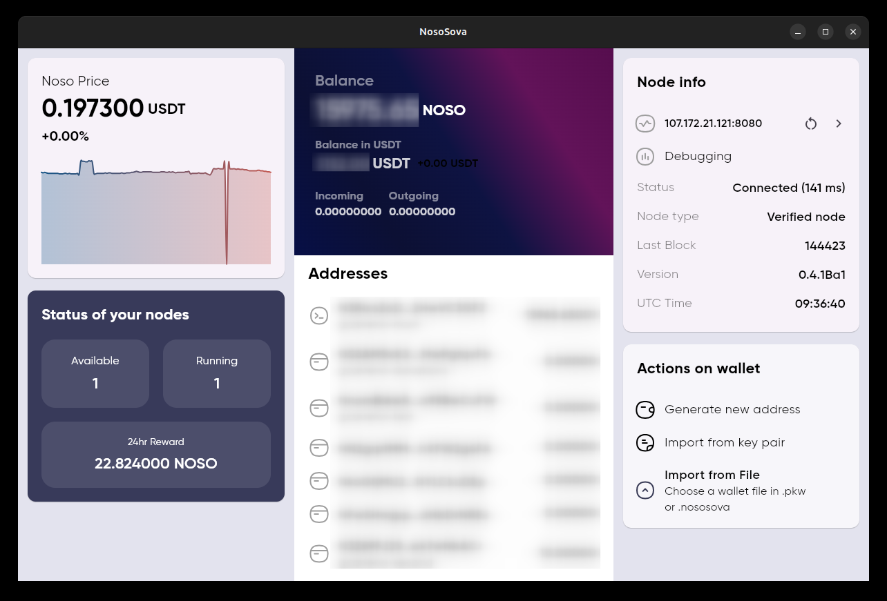
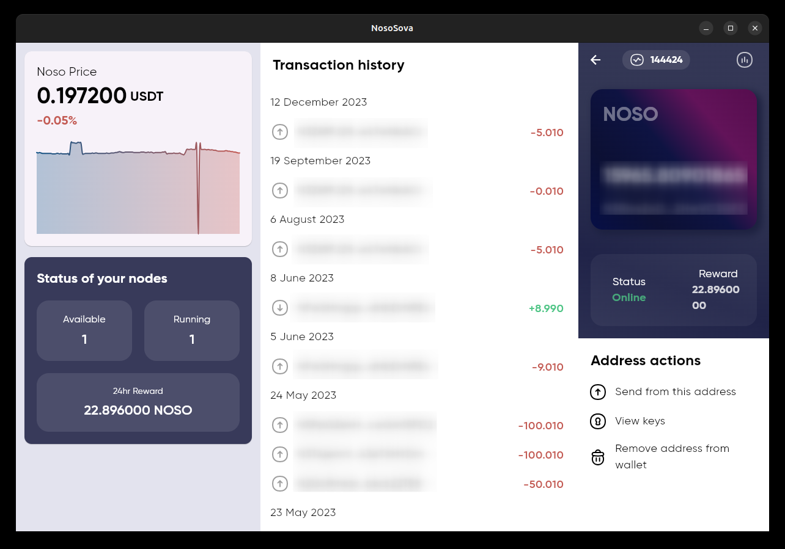

# NosoSova

This is a `lite` wallet for the cryptocurrency [Noso](https://nosocoin.com).

The application is being developed in Flutter(Dart).

At the moment the development of this application is still in constant flux, since it's at an alpha stage.

## Screenshots

### Linux

Main window with a graph of `Noso`'s price(Left), Details about the wallet and a list of addresses(Center) and some information about the network(Right):

Account details:

